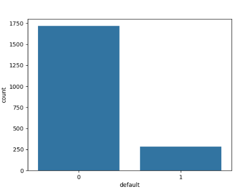
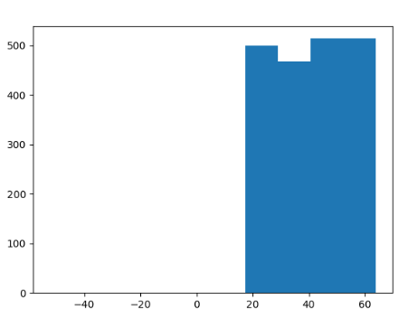
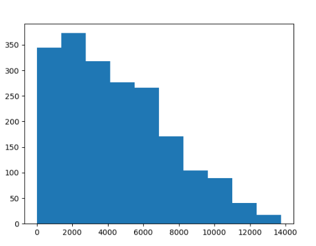
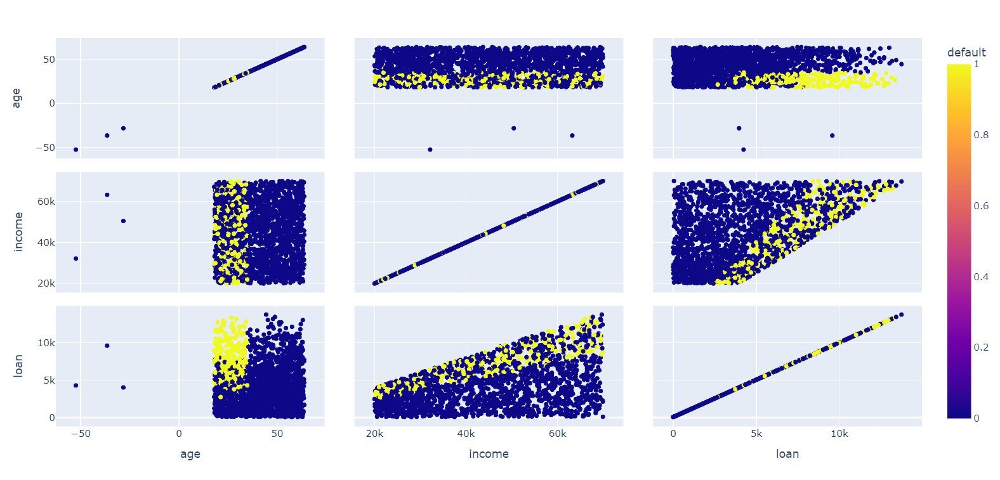

# Machine Learn

## Métodos preditivos

### Classificação (rótulos)

#### Marketing direto
#### Insatisfação de clientes
#### Risco de crédito
#### Filtros de spam
#### Separação de notícias
#### Reconhecimento de voz
#### Reconhecimento de face
#### Previsão de doenças

### Regressão (números)

#### Gastos propaganda -> valor de venda
#### Temperatura, umidade e pressão do ar -> velocidade do vento
#### Fatores externos -> valor do dólar
#### Resultados do exame -> probabilidade de um paciente sobreviver
#### Risco de investimento
#### Gastos no cartão de crédito, histórico -> limite
#### Valores anteriores -> valores de produtos

## Métodos Descritivos

### Associação

#### Prateleiras de mercado
#### Promoções com itens que são vendidos em conjunto
#### Planejar catálogos de lojas e folhetos de promoções
#### Controle de evasão em universidades

### Agrupamento

#### Segmentação de mercado
#### Agrupamento de documentos / notícias
#### Agrupamento de produtos similares
#### Perfil de clientes (netflix)
#### Análise de redes sociais

### Detecção de desvios (outliers)

#### Fraude em cartão de crédito
#### Intrusão em redes
#### Uso de energia elétrica, água ou telefone
#### Desempenho de atletas (doping)
#### Monitorar máquinas em um data center

### Padrões sequenciais

#### Livrarias, lojas de equipamentos de atletismo, computadores
#### Marketing para adquirir um novo produto
#### Previsão de doenças
#### Navegação em sites

### Sumarização

#### São ouvintes do programa, homens na faixa de 25 a 35 anos, com nível superior e que trabalham na área de administração
#### Segmentação de mercado

## Tipos de apredizagem de máquina

### Supervisionada

#### Supervisor ajuda o algoritmo a aprender

### Não supervisionada

#### Analisar automaticamente os dados (associação, agrupamento)
#### Necessita análise para determinar o significado dos padrões encontradas

### Reforço

#### Aprender com as interações com o ambiente (causa e efeito)

## Classificação - Pré-processamento com pandas e scikit-learn

### Variáveis

##### Numéricas
###### Contínua (números reais. temperatura, altura, peso, salário)
###### Discreta (conjuto de valores finitos (inteiros)) Contagem
##### Categóricas
###### Nominal (dados não mensuráveis, sem ordenação: cor dos olhos, gênero, nome)
###### Ordinal (Categorização sob uma ordenação. Tamanho P, M, G)

### Base de crédito

```bash
pip -q install plotly
pip -q install yellowbrick
```
```bash
import pandas as pd
import numpy as np
import seaborn as sns
import matplotlib.pyplot as plt
import plotly.express as px
```
Carregar a base de dados
```bash
base_credit = pd.read_csv('credit_data.csv')
```
Visualizar os 5 primeiros registros
```bash
print(base_credit)
```
| clientid |    income    |       age | loan        | default |
|:---------|:------------:|----------:|-------------|--------:|
| 1        | 66155.925095 | 59.017015 | 8106.532131 |       0 |
| 2        | 34415.153966 | 48.117153 | 6564.745018 |       0 |
| 3        | 57317.170063 | 63.108049 | 8020.953296 |       0 |
| 4        | 42709.534201 | 45.751972 | 6103.642260 |       0 |
| 5        | 66952.688845 | 18.584336 | 8770.099235 |       1 |

Visualizar os 5 últimos registros
```bash
print(base_credit.tail(5))
```
| clientid |    income    |       age | loan        | default |
|:---------|:------------:|----------:|-------------|--------:|
| 1996     | 59221.044874 | 48.518179 | 1926.729397 |       0 |
| 1996     | 69516.127573 | 23.162104 | 3503.176156 |       0 |
| 1998     | 44311.449262 | 28.017167 | 5522.786693 |       1 |
| 1999     | 43756.056605 | 63.971796 | 1622.722598 |       0 |
| 2000     | 69436.579552 | 56.152617 | 7378.833599 |       0 |

Estatísticas
```bash
print(base_credit.describe())
```
|       |    clientid |       income |         age |         loan |     default |
|-------|------------:|-------------:|-------------|-------------:|------------:|
| count | 2000.000000 |  2000.000000 | 1997.000000 |  2000.000000 | 2000.000000 |
| mean  | 1000.500000 | 45331.600018 |   40.807559 |  4444.369695 |    0.141500 |
| std   |  577.494589 | 14326.327119 |   13.624469 |  3045.410024 |    0.348624 |
| min   |    1.000000 | 20014.489470 |  -52.423280 |     1.377630 |    0.000000 |
| 25%   |  500.750000 | 32796.459717 |   28.990415 |  1939.708847 |    0.000000 |
| 50%   | 1000.500000 | 45789.117313 |   41.317159 |  3974.719419 |    0.000000 |
| 75%   | 1500.250000 | 57791.281668 |   52.587040 |  6432.410625 |    0.000000 |
| max   | 2000.000000 | 69995.685578 |   63.971796 | 13766.051239 |    1.000000 |

Filtro de quem deve mais de 10.000
```bash
print(base_credit[base_credit['loan'] >= 13000.000])
```
| clientid |    income    |       age | loan         | default |
|:---------|:------------:|----------:|--------------|--------:|
| 481      | 66049.934032 | 29.315767 | 13172.681298 |       1 |
| 768      | 67520.759597 | 45.415624 | 13041.779452 |       0 |
| 1051     | 69456.567771 | 48.053557 | 13190.365886 |       0 |
| 1351     | 69592.010828 | 63.238625 | 13025.056571 |       0 |
| 1379     | 69755.320163 | 44.543682 | 13766.051239 |       0 |

Filtro de quem deve menos de 1.377630
```bash
print(base_credit[base_credit['loan'] <= 1.377630])
```
| clientid |    income    |       age | loan    | default |
|:---------|:------------:|----------:|---------|--------:|
| 866      | 28072.604355 | 54.142548 | 1.37763 |       0 |

Contagem de quantos registros existem em cada uma das classes.
Classe 0, pagou o empréstimo e classe 1, não pagou o empréstimo.
```bash
print(np.unique(base_credit['default'], return_counts=True))
```
(array([0, 1], dtype=int64), array([1717,  283], dtype=int64))

Gerar gráfico de contagem de registros das classes
```bash
sns.countplot(x = base_credit['default'])
plt.show()
```


Histograma de idade
```bash
plt.hist(x = base_credit['age'])
plt.show()
```


Histograma de renda
```bash
plt.hist(x = base_credit['income'])
plt.show()
```


Histograma de dívida
```bash
plt.hist(x = base_credit['loan'])
plt.show()
```


Gráfico de dispersão
```bash
grafico = px.scatter_matrix(base_credit, dimensions=['age', 'income', 'loan'], color = 'default')
grafico.show()
```

