# Machine Learn

## Métodos preditivos

### Classificação (rótulos)

#### Marketing direto
#### Insatisfação de clientes
#### Risco de crédito
#### Filtros de spam
#### Separação de notícias
#### Reconhecimento de voz
#### Reconhecimento de face
#### Previsão de doenças

### Regressão (números)

#### Gastos propaganda -> valor de venda
#### Temperatura, umidade e pressão do ar -> velocidade do vento
#### Fatores externos -> valor do dólar
#### Resultados do exame -> probabilidade de um paciente sobreviver
#### Risco de investimento
#### Gastos no cartão de crédito, histórico -> limite
#### Valores anteriores -> valores de produtos

## Métodos Descritivos

### Associação

#### Prateleiras de mercado
#### Promoções com itens que são vendidos em conjunto
#### Planejar catálogos de lojas e folhetos de promoções
#### Controle de evasão em universidades

### Agrupamento

#### Segmentação de mercado
#### Agrupamento de documentos / notícias
#### Agrupamento de produtos similares
#### Perfil de clientes (netflix)
#### Análise de redes sociais

### Detecção de desvios (outliers)

#### Fraude em cartão de crédito
#### Intrusão em redes
#### Uso de energia elétrica, água ou telefone
#### Desempenho de atletas (doping)
#### Monitorar máquinas em um data center

### Padrões sequenciais

#### Livrarias, lojas de equipamentos de atletismo, computadores
#### Marketing para adquirir um novo produto
#### Previsão de doenças
#### Navegação em sites

### Sumarização

#### São ouvintes do programa, homens na faixa de 25 a 35 anos, com nível superior e que trabalham na área de administração
#### Segmentação de mercado

## Tipos de apredizagem de máquina

### Supervisionada

#### Supervisor ajuda o algoritmo a aprender

### Não supervisionada

#### Analisar automaticamente os dados (associação, agrupamento)
#### Necessita análise para determinar o significado dos padrões encontradas

### Reforço

#### Aprender com as interações com o ambiente (causa e efeito)

## Classificação - Pré-processamento com pandas e scikit-learn

### Variáveis

##### Numéricas
###### Contínua (números reais. temperatura, altura, peso, salário)
###### Discreta (conjuto de valores finitos (inteiros)) Contagem
##### Categóricas
###### Nominal (dados não mensuráveis, sem ordenação: cor dos olhos, gênero, nome)
###### Ordinal (Categorização sob uma ordenação. Tamanho P, M, G)

### Base de crédito

```bash
pip -q install plotly
pip -q install yellowbrick
```
```bash
import pandas as pd
import numpy as np
import seaborn as sns
import matplotlib.pyplot as plt
import plotly.express as px
```
Carregar a base de dados
```bash
base_credit = pd.read_csv('credit_data.csv')
```
Visualizar os 5 primeiros registros
```bash
print(base_credit.head(5))
```
| clientid |    income    |       age | loan        | default |
|:---------|:------------:|----------:|-------------|--------:|
| 1        | 66155.925095 | 59.017015 | 8106.532131 |       0 |
| 2        | 34415.153966 | 48.117153 | 6564.745018 |       0 |
| 3        | 57317.170063 | 63.108049 | 8020.953296 |       0 |
| 4        | 42709.534201 | 45.751972 | 6103.642260 |       0 |
| 5        | 66952.688845 | 18.584336 | 8770.099235 |       1 |

Visualizar os 5 últimos registros
```bash
print(base_credit.tail(5))
```
| clientid |    income    |       age | loan        | default |
|:---------|:------------:|----------:|-------------|--------:|
| 1996     | 59221.044874 | 48.518179 | 1926.729397 |       0 |
| 1996     | 69516.127573 | 23.162104 | 3503.176156 |       0 |
| 1998     | 44311.449262 | 28.017167 | 5522.786693 |       1 |
| 1999     | 43756.056605 | 63.971796 | 1622.722598 |       0 |
| 2000     | 69436.579552 | 56.152617 | 7378.833599 |       0 |

Estatísticas
```bash
print(base_credit.describe())
```
|       |    clientid |       income |         age |         loan |     default |
|-------|------------:|-------------:|-------------|-------------:|------------:|
| count | 2000.000000 |  2000.000000 | 1997.000000 |  2000.000000 | 2000.000000 |
| mean  | 1000.500000 | 45331.600018 |   40.807559 |  4444.369695 |    0.141500 |
| std   |  577.494589 | 14326.327119 |   13.624469 |  3045.410024 |    0.348624 |
| min   |    1.000000 | 20014.489470 |  -52.423280 |     1.377630 |    0.000000 |
| 25%   |  500.750000 | 32796.459717 |   28.990415 |  1939.708847 |    0.000000 |
| 50%   | 1000.500000 | 45789.117313 |   41.317159 |  3974.719419 |    0.000000 |
| 75%   | 1500.250000 | 57791.281668 |   52.587040 |  6432.410625 |    0.000000 |
| max   | 2000.000000 | 69995.685578 |   63.971796 | 13766.051239 |    1.000000 |

Filtro de quem deve mais de 10.000
```bash
print(base_credit[base_credit['loan'] >= 13000.000])
```
| clientid |    income    |       age | loan         | default |
|:---------|:------------:|----------:|--------------|--------:|
| 481      | 66049.934032 | 29.315767 | 13172.681298 |       1 |
| 768      | 67520.759597 | 45.415624 | 13041.779452 |       0 |
| 1051     | 69456.567771 | 48.053557 | 13190.365886 |       0 |
| 1351     | 69592.010828 | 63.238625 | 13025.056571 |       0 |
| 1379     | 69755.320163 | 44.543682 | 13766.051239 |       0 |

Filtro de quem deve menos de 1.377630
```bash
print(base_credit[base_credit['loan'] <= 1.377630])
```
| clientid |    income    |       age | loan    | default |
|:---------|:------------:|----------:|---------|--------:|
| 866      | 28072.604355 | 54.142548 | 1.37763 |       0 |

### Visualização dos dados
Contagem de quantos registros existem em cada uma das classes.
Classe 0, pagou o empréstimo e classe 1, não pagou o empréstimo.
```bash
print(np.unique(base_credit['default'], return_counts=True))
```
(array([0, 1], dtype=int64), array([1717,  283], dtype=int64))

Gerar gráfico de contagem de registros das classes
```bash
sns.countplot(x = base_credit['default'])
plt.show()
```


Histograma de idade
```bash
plt.hist(x = base_credit['age'])
plt.show()
```


Histograma de renda
```bash
plt.hist(x = base_credit['income'])
plt.show()
```


Histograma de dívida
```bash
plt.hist(x = base_credit['loan'])
plt.show()
```


Gráfico de dispersão
```bash
grafico = px.scatter_matrix(base_credit, dimensions=['age', 'income', 'loan'], color = 'default')
grafico.show()
```


### Tratamento de valores inconsistentes
verificar clientes com idade menor que zero
```bash
print(base_credit.loc[base_credit['age'] < 0])
```
| clientid |    income    |        age | loan        | default |
|:---------|:------------:|-----------:|-------------|--------:|
| 16       | 50501.726689 | -28.218361 | 3977.287432 |       0 |    
| 22       | 32197.620701 | -52.423280 | 4244.057136 |       0 |
| 27       | 63287.038908 | -36.496976 | 9595.286289 |       0 |

Podemos apagar a coluna inteira

Vamos criar uma nova variável pra receber a nova base
```bash
base_credit2 = base_credit.drop('age', axis = 1)
print(base_credit2)
```
| clientid |    income    | loan        | default |
|:---------|:------------:|-------------|--------:|
| 1        | 66155.925095 | 8106.532131 |       0 |
| 2        | 34415.153966 | 6564.745018 |       0 |
| 3        | 57317.170063 | 8020.953296 |       0 |
| 4        | 42709.534201 | 6103.642260 |       0 |
| 5        | 66952.688845 | 8770.099235 |       1 |
...

Podemos apagar os registros com valores inconsistentes

Vamos criar uma nova variável pra receber a nova base
```bash
base_credit3 = base_credit.drop(base_credit[base_credit['age'] < 0].index)
print(base_credit3)
```
| clientid |    income    |       age | loan        | default |
|:---------|:------------:|----------:|-------------|--------:|
| 1        | 66155.925095 | 59.017015 | 8106.532131 |       0 |
| 2        | 34415.153966 | 48.117153 | 6564.745018 |       0 |
| 3        | 57317.170063 | 63.108049 | 8020.953296 |       0 |
| 4        | 42709.534201 | 45.751972 | 6103.642260 |       0 |
| 5        | 66952.688845 | 18.584336 | 8770.099235 |       1 |
...

Podemos preencher os valores inconsistentes manualmente com as médias de idade

```bash
print(base_credit.mean())
```
clientid     1000.500000
income      45331.600018
age            40.807559
loan         4444.369695
default         0.141500
dtype: float64

```bash
print(base_credit['age'].mean())
```
40.80755937840458

Está calculando com as idades negativas, vamos corrigir
```bash
print(base_credit['age'][base_credit['age'] > 0].mean())
```
40.92770044906149

Vamos atualizar os valores
```bash
print(base_credit.loc[base_credit['age'] < 0, 'age'] = 40.92 )
```
Realizar uma nova consulta
```bash
print(base_credit.loc[base_credit['age'] < 0])
```
Empty DataFrame
Columns: [clientid, income, age, loan, default]
Index: []

```bash
base_credit.loc[base_credit['age'] == 40.92]
```
| clientid |    income    |   age | loan        | default |
|:---------|:------------:|------:|-------------|--------:|
| 16       | 50501.726689 | 40.92 | 3977.287432 |       0 |    
| 22       | 32197.620701 | 40.92 | 4244.057136 |       0 |
| 27       | 63287.038908 | 40.92 | 9595.286289 |       0 |

Histograma de idade
```bash
plt.hist(x = base_credit['age'])
plt.show()
```
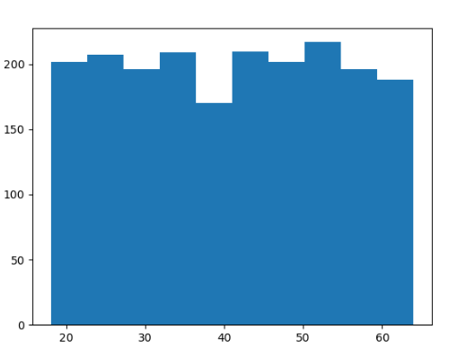

Gráfico de dispersão
```bash
grafico = px.scatter_matrix(base_credit, dimensions=['age', 'income', 'loan'], color = 'default')
grafico.show()
```
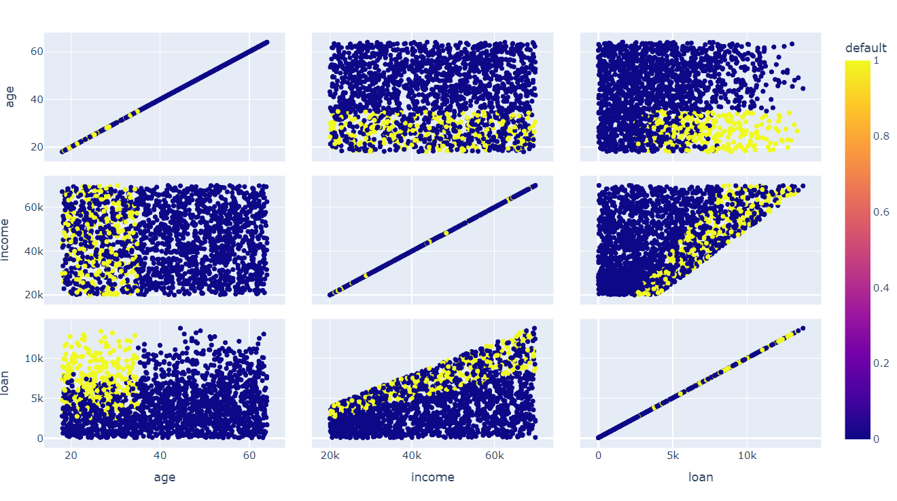

### Tratamento de valores faltantes
```bash
print(base_credit.isnull())
```
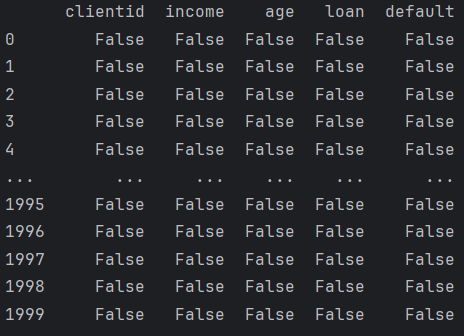

```bash
print(base_credit.isnull().sum())
```
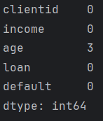

```bash
print(base_credit.loc[pd.isnull(base_credit['age'])])
```
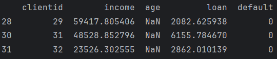

```bash
base_credit['age'].fillna(base_credit['age'].mean(), inplace = True)
print(base_credit.loc[pd.isnull(base_credit['age'])])
```
Empty DataFrame
Columns: [clientid, income, age, loan, default]
Index: []

```bash
print(base_credit.loc[base_credit['clientid'].isin([29, 31, 32])])
```
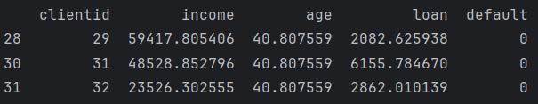

### Divisão entre previsores e classe
Vamos usar iloc para pegar os valores de todas as linhas ":" da coluna 1 (income) até a coluna 3 (loan) "1:4"
Previsores
```bash
X_credit = base_credit.iloc[:, 1:4].values
print(X_credit)
```
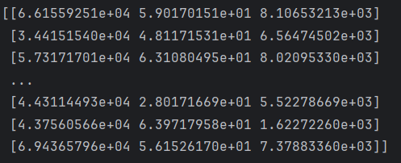

Vamos pegar os valoes da classe, coluna 4 (default)
Classes
```bash
y_credit = base_credit.iloc[:, 4].values
print(y_credit)
```
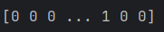

### Escalonamento dos atributos
Evitar que o algoritmo interprete a importância dos atributos errado
Pessoa com a menor renda
```bash
print(X_credit[:, 0].min())
```
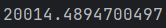
Para as outras colunas, é só mudar o indice
```bash
print(X_credit[:, 1].min()) #idade
print(X_credit[:, 2].min()) #divida
```

Pessoa com a maior renda
```bash
print(X_credit[:, 0].max())
```
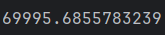
Para as outras colunas, é só mudar o indice
```bash
print(X_credit[:, 1].max()) #idade
print(X_credit[:, 2].max()) #divida
```
Deixar os valores na mesma escala

Padronização (Standardisation)
```bash
x = x - media(x) / desvio padrão(x)
```
Normalização (Normalization)
```bash
x = x - minimo(x) / maximo(x) - minimo(x)
```
Usando padronização
```bash
scaler_credit = StandardScaler()
X_credit = scaler_credit.fit_transform(X_credit)
print(X_credit[:,0].min(), X_credit[:,1].min(), X_credit[:,2].min())
```
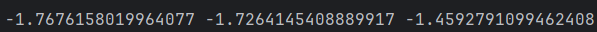
Antes da transformação
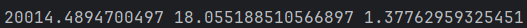

### Base de dados do censo
Outras bases: http://archive.ics.uci.edu/ml/datasets/adult

```bash
base_census = pd.read_csv('census.csv')
print(base_census)
```
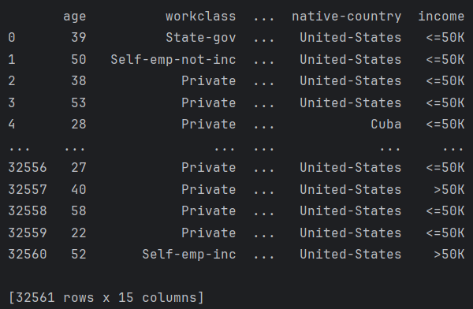

Estatísticas
```bash
print(base_census.describe())
```
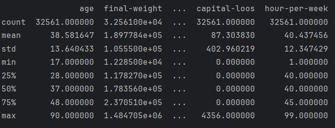

Existe valores faltantes?
```bash
print(base_census.isnull().sum())
```
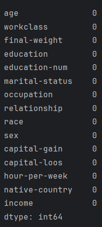

Não precisamos ajustar os dados da base de dados

### Visualização dos dados
Visualizar os dados da nossa classe
```bash
print(np.unique(base_census['income'], return_counts=True))
```
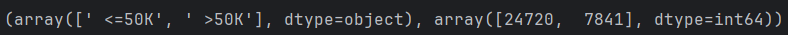
```bash
sns.countplot(x = base_census['income'])
plt.show()
```
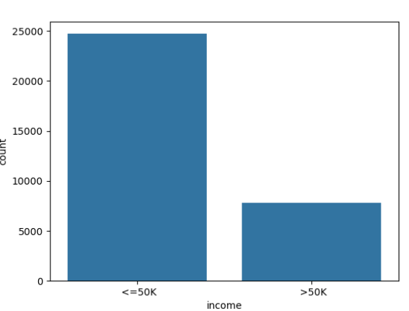
```bash
grafico = px.treemap(base_census, path=['workclass'])
grafico.show()
```
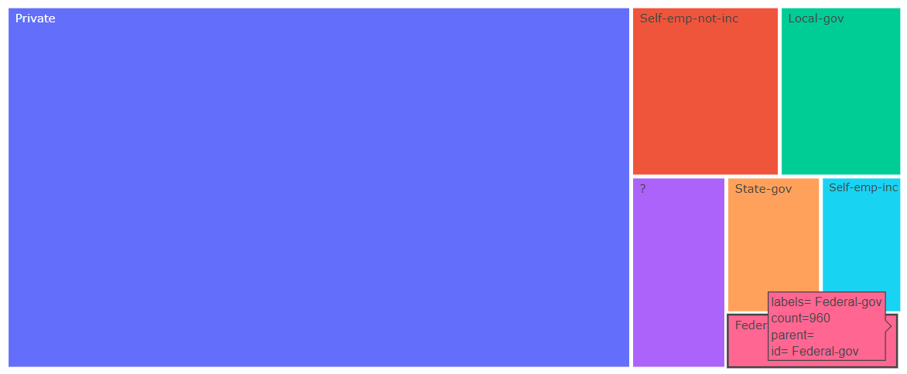
```bash
grafico = px.treemap(base_census, path=['workclass', 'age'])
grafico.show()
```
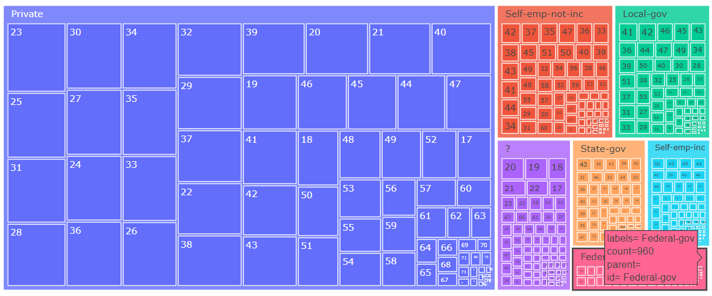
```bash
grafico = px.parallel_categories(base_census, dimensions=['occupation', 'relationship'])
grafico.show()
```
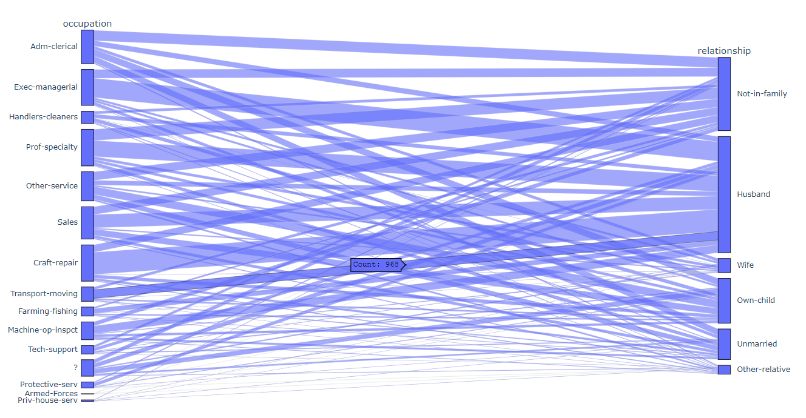

### Divisão entre previsores e classes

Vamos usar iloc para pegar os valores de todas as linhas ":" da coluna 0 (age) até a coluna 13 (native-country) "1:14"
Previsores
```bash
X_census = base_census.iloc[:, 0:14].values
print(X_census)
```
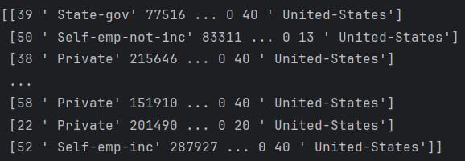

Vamos pegar os valoes da classe, coluna 14 (income)
Classes
```bash
y_census = base_census.iloc[:, 14].values
print(y_census)
```
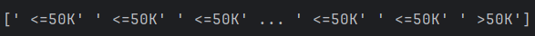

### Atributos categóricos - LabelEncoder (string para números)
```bash
label_encoder_teste = LabelEncoder()
print(X_census[:,1])
teste = label_encoder_teste.fit_transform(X_census[:,1])
print(teste)
```
Antes

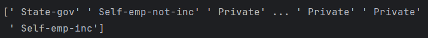
Depois

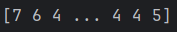

Transformar cada atributo
```bash
label_encoder_workclass = LabelEncoder()
label_encoder_education = LabelEncoder()
label_encoder_marital = LabelEncoder()
label_encoder_occupation = LabelEncoder()
label_encoder_relationship = LabelEncoder()
label_encoder_race = LabelEncoder()
label_encoder_sex = LabelEncoder()
label_encoder_country = LabelEncoder()

X_census[:,1] = label_encoder_workclass.fit_transform(X_census[:,1])
X_census[:,3] = label_encoder_education.fit_transform(X_census[:,3])
X_census[:,5] = label_encoder_marital.fit_transform(X_census[:,5])
X_census[:,6] = label_encoder_occupation.fit_transform(X_census[:,6])
X_census[:,7] = label_encoder_relationship.fit_transform(X_census[:,7])
X_census[:,8] = label_encoder_race.fit_transform(X_census[:,8])
X_census[:,9] = label_encoder_sex.fit_transform(X_census[:,9])
X_census[:,13] = label_encoder_country.fit_transform(X_census[:,13])

print(X_census)
```
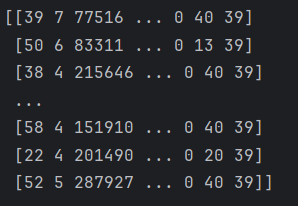

### Atributos categóricos - OneHotEncoder (evitar que o algoritmo interprete erroneamente o indice do array como peso no cálculo)
Exemplo
```bash
# Carro

#Gol  Pálio Uno
#  1      2   3

#Gol    1 0 0
#Pálio  0 1 0
#Uno    0 0 1 #
```
1 coluna por categoria
```bash
print(len(np.unique(base_census['workclass'])))

onehotencoder_census = ColumnTransformer(transformers=[('OneHot', OneHotEncoder(), [0,1,3,5,6,7,8,9,13])], remainder='passthrough')
X_census = onehotencoder_census.fit_transform(X_census).toarray()
print(X_census)
```
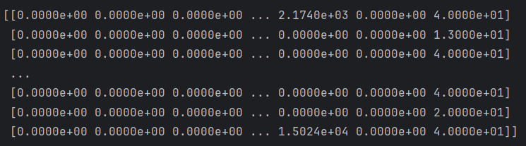
```bash
print(X_census.shape)
```
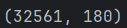

Agora temos 108 colunas na base

### Escalonamento dos atributos (evitar que o algoritmo interprete erroneamente o valor da variável muito mais alto do que outra variável, como peso no cálculo)
Antes
```bash
print(X_census[0])
```
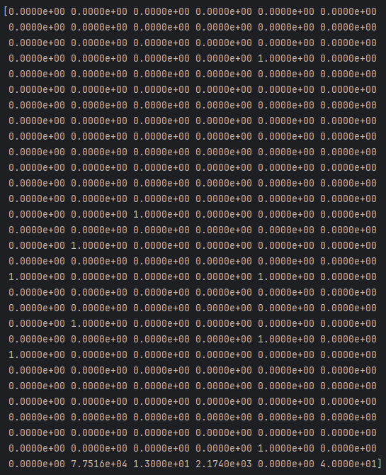
Depois
```bash
scaler_census = StandardScaler()
X_census = scaler_census.fit_transform(X_census)
print(X_census[0])
```
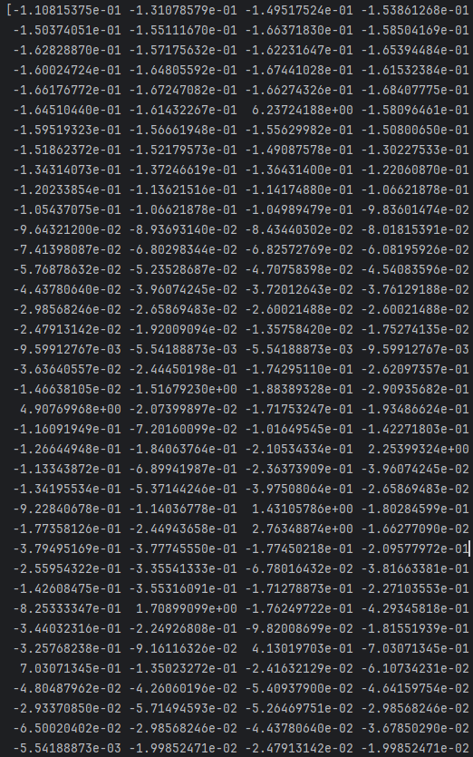

### Introdução a avaliação de algoritmos
O algorítmo avalia os dados e gera um modelo baseado nos dados
Divisão da base entre teinamento e teste. Não podem ter os mesmos dados para não enganar o algorítmo

Ex: Naive Bayes

Gera tabela de probabilidades baseado no treinamento. 
Submente os registros de teste ao algorítmo para comparar com o treinamento.
Baseado nos acertos, é calculada a taxa de acerto: número de acertos / número de registros
0.75 * 100 = 75%

### Base de treinamento e teste

Para realizar a divisão da base de dados, executamos o comando abaixo, o mais importante é o random_state, que garante que os dados serão gerados sempre iguais, os mesmo registros em treinamento e teste
O parâmetro test_size é o tamanho da base dados de teste, 25%, no comando abaixo (0.25)
Base de crédito
```bash
X_credit_treinamento, X_credit_teste, y_credit_treinamento, y_credit_teste = train_test_split(X_credit, y_credit, test_size=0.25, random_state=0)
print(X_credit_treinamento.shape)
```
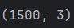
Base do censo
```bash
X_census_treinamento, X_census_teste, y_census_treinamento, y_census_teste = train_test_split(X_census, y_census, test_size=0.15, random_state=0)
print(X_census_treinamento.shape, y_census_treinamento.shape)
print(X_census_teste.shape, y_census_teste.shape)
```
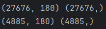
A quantidade de registros na na base de teste e teinamento, precisam estar iguais (27676 = 27676, 4885 = 4885)

### Salvar as bases de dados
Vamos usar o pickle
```bash
with open('credit.pkl', mode='wb') as f:
    pickle.dump([X_credit_treinamento, y_credit_treinamento, X_credit_teste, y_credit_teste], f)

with open('census.pkl', mode='wb') as f:
    pickle.dump([X_census_treinamento, y_census_treinamento, X_census_teste, y_census_teste], f)
```
Vai criar dois aquivos, credit.pkl e census.pkl.

Para mais exemplos sobre pré-processamento de bases de dados, consulte: https://scikit-learn.org/stable/modules/preprocessing.html

E também:

Livro Python Machine Learning de Sebastian Raschka: o capítulo 4 do livro é sobre a construção de boas bases de dados utilizando técnicas de pré-processamento

Livro Machine Learning with Python de Chris Albon: os capítulos iniciais do livro apresentam uma variedade grande de técnicas de pré-processamento

Capítulo Data Quality de Tamraparni Dasu e Theodore Johnson da série de livros Wiley Series in Probability and Statistics: ótimo complemento depois da aprendizagem das técnicas de pré-processamento

## Aprendizagem bayesiana
Em teoria das probabilidades e estatística, o teorema de Bayes (alternativamente, a lei de Bayes ou a regra de Bayes) descreve a probabilidade de um evento acontecer, com base em um conhecimento que pode estar relacionado ao evento.

### Introdução
Baseado em probabilidade, principalmente texto. (Teorema de Bayes)
Exemplos:

Filtros de spam, mineração de emoções, separação de documentos

Ele gera uma tabela de probabilidades

Vantagens: Rápido, Simplicidade de interpretação, Trabalha com altas dimensões, Boas previsões em bases pequenas
Desvantagens: Combinação de características (atributos independentes) - cada par de características são independentes - nem sempre é verdade

### Base risco de crédito

```bash
base_risco_credito = pd.read_csv('risco_credito.csv')
print(base_risco_credito)
```
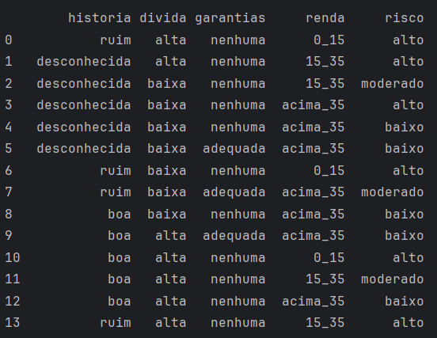

Divisão previsores e classe
```bash
X_risco_credito = base_risco_credito.iloc[:, 0:4].values
y_risco_credito = base_risco_credito.iloc[:, 4].values
label_encoder_historia = LabelEncoder()
label_encoder_divida = LabelEncoder()
label_encoder_garantia = LabelEncoder()
label_encoder_renda = LabelEncoder()
X_risco_credito[:,0] = label_encoder_historia.fit_transform(X_risco_credito[:,0])
X_risco_credito[:,1] = label_encoder_divida.fit_transform(X_risco_credito[:,1])
X_risco_credito[:,2] = label_encoder_garantia.fit_transform(X_risco_credito[:,2])
X_risco_credito[:,3] = label_encoder_renda.fit_transform(X_risco_credito[:,3])
```
Como a base é pequna não vamos aplicar o OneHotEncoder

Salvado a base
```bash
with open('risco_credito.pkl', mode='wb') as f:
    pickle.dump([X_risco_credito, y_risco_credito], f)
```
Criando o algorítimo
```bash
naive_risco_credito = GaussianNB()
naive_risco_credito.fit(X_risco_credito, y_risco_credito)

# história boa (0), dívida alta (0), garantias nenhuma (1), renda > 35 (2)
# história ruim (2), divida alta (0), garantias adequada (0), renda < 15 (0)

previsao = naive_risco_credito.predict([[0,0,1,2],[2,0,0,0]])
print(previsao)
```
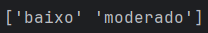

```bash
print(naive_risco_credito.classes_)
print(naive_risco_credito.class_count_)
print(naive_risco_credito.class_prior_)
```
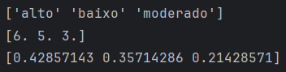

### Base crédito
```bash
with open('credit.pkl', mode='rb') as f:
    X_credit_treinamento, y_credit_treinamento, X_credit_teste, y_credit_teste = pickle.load(f)
print(X_credit_treinamento.shape, y_credit_treinamento.shape)
print(X_credit_teste.shape, y_credit_teste.shape)
```
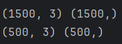

Treinando e executando o algorítmo
```bash
naive_credit_data = GaussianNB()
naive_credit_data.fit(X_credit_treinamento, y_credit_treinamento)
previsoes = naive_credit_data.predict(X_credit_teste)
print(previsoes)
```
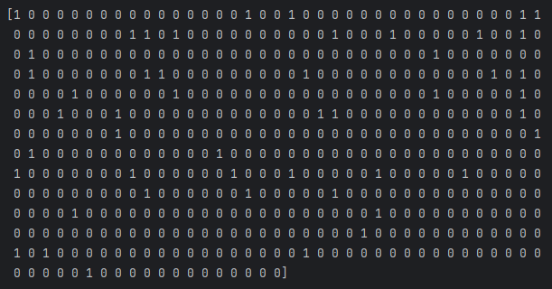
Comparando
```bash
print(y_credit_teste)
```
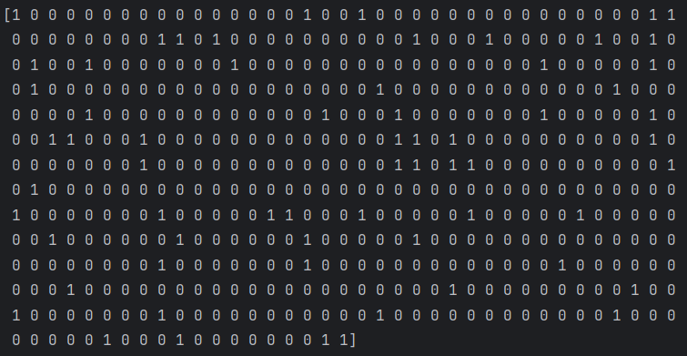
Comparando com o sklearn
```bash
print(accuracy_score(y_credit_teste, previsoes))
```
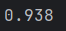
O algorítmo acertou 93%

Matriz de confusão
```bash
print(confusion_matrix(y_credit_teste, previsoes))
```
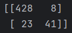
428 pagam e foram classificados como pagam

8 pagam e foram classificados como não pagam

23 clientes não pagam e foram classificados como pagam

41 clientes não pagam e foram classificados como não pagam

Matriz de confusão yellowbrick
```bash
cm = ConfusionMatrix(naive_credit_data)
cm.fit(X_credit_treinamento, y_credit_treinamento)
cm.score(X_credit_teste, y_credit_teste)
plt.show()
```
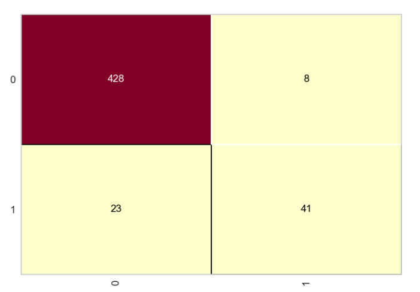
Relatório de classificação
```bash
print(classification_report(y_credit_teste, previsoes))
```
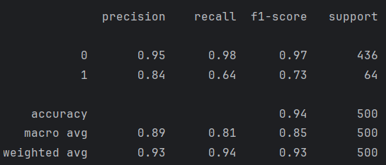

### Base censo
```bash
with open('census.pkl', mode='rb') as f:
    X_census_treinamento, y_census_treinamento, X_census_teste, y_census_teste = pickle.load(f)
print(X_census_treinamento.shape, y_census_treinamento.shape)
print(X_census_teste.shape, y_census_teste.shape)
```
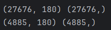

Treinando e executando o algorítmo
```bash
naive_census_data = GaussianNB()
naive_census_data.fit(X_census_treinamento, y_census_treinamento)
previsoes = naive_census_data.predict(X_census_teste)
print(previsoes)
print(y_census_teste)
```
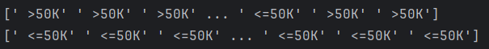
O treinamento errou a maioria das previsões

Acuracidade
```bash
print(accuracy_score(y_census_teste, previsoes))
```
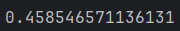

Taxa muito baixa. O fato de termos apenas duas classes, influencia nesse resultado
Se não executar o escalonamento, pode chegar a 70% de acuracidade, no caso Bayes.

Matriz de confusão
```bash
cm = ConfusionMatrix(naive_census_data)
cm.fit(X_census_treinamento, y_census_treinamento)
cm.score(X_census_teste, y_census_teste)
plt.show()
```
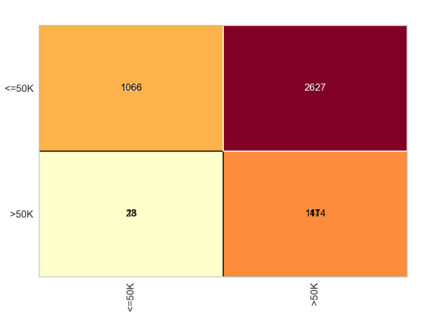

Relatório de classificação
```bash
print(classification_report(y_census_teste, previsoes))
```
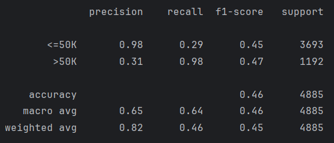
